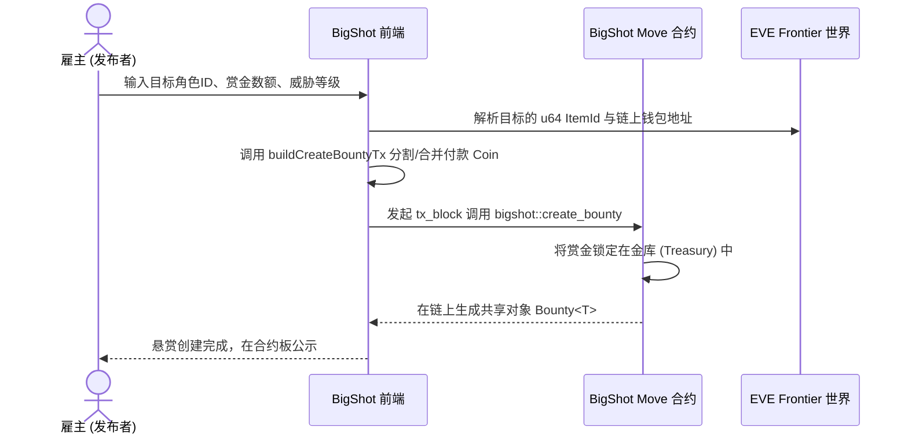
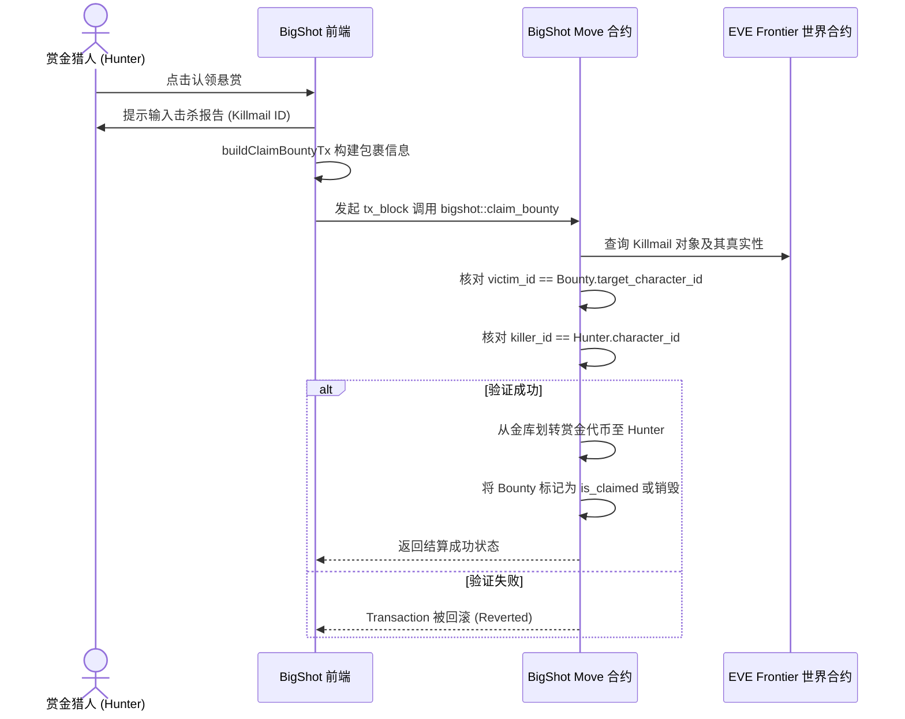
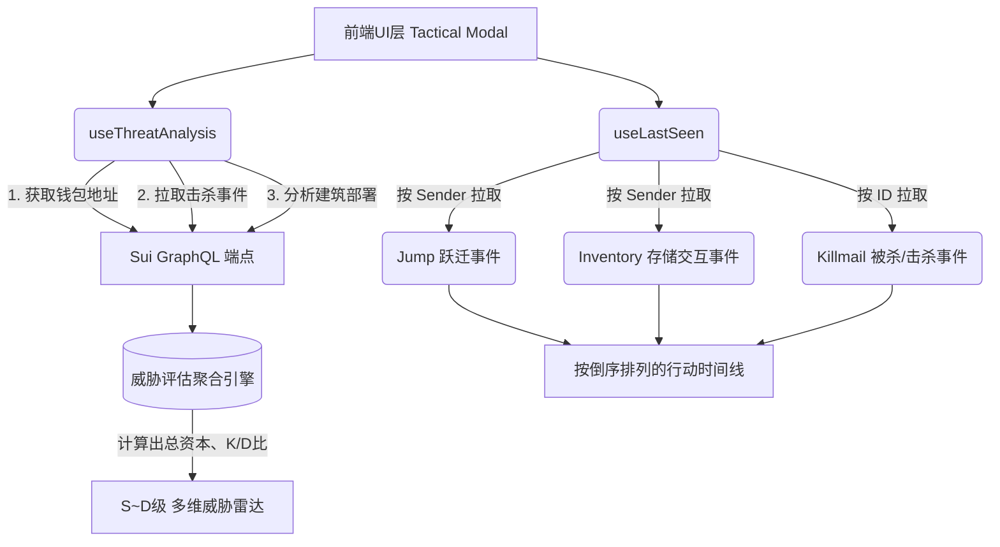

[Read in English](./README.md)

# BigShot - EVE Frontier Decentralised Bounty Protocol (项目总结与运作机制)

## 1. 项目介绍 (Project Overview)

BigShot 是一款旨在为 **EVE Frontier** 提供去中心化赏金猎人系统的 DApp。它利用 **Sui 区块链** 的高性能和面向资产的智能合约(Move)，允许玩家发布对特定游戏角色的悬赏并存入质押金，而赏金猎人则可以通过出示链上真实生成的“击杀邮件 (Killmail)”来去中心化地获取赏金。

### 核心特性
- **链上托管 (On-Chain Escrow)**：雇主使用 `LUX` 或原生 `EVE`、`SUI` 代币发布悬赏，资金安全锁定在智能合约金库中，没有中间人。
- **原生击杀证明 (Native Killmail Check)**：猎人直接调用智能合约验证 EVE Frontier World 中原生的 `Killmail` 对象，彻底杜绝伪造截图。
- **匿名猎杀与认领 (Anonymous)**：集成了 zkLogin 等相关前置逻辑，使猎人能够安全进行加密资产提取。
- **动态战术情报 (Tactical Intelligence)**：利用 Sui GraphQL 查询目标角色的近期跃迁 (Jump)、击杀记录、库存交互 (Deposit/Withdraw)，为猎人提供可视化的时间线与多维度“危险等级”分析。

---

## 2. 运作架构与核心流程图 (Architecture & Operation Flow)

项目的完整业务闭环主要涉及三个角色：**悬赏发布者 (Issuer)**、**赏金猎人 (Hunter)** 与 **目标 (Target)**。主要流程包含悬赏的创建、接取/查看以及结算。

### 2.1 悬赏创建流程 (Bounty Creation Flow)

使用指定的代币作为资产储备（如 SUI，EVE 或 LUX），并在链上创建一个共享的 Bounty 对象。

### 2.2 悬赏认领流程 (Claiming Bounty Flow)

猎人实现击杀后，游戏的世界引擎会生成一份 Killmail 对象，通过比对该对象上的信息完成去中心化付款。

### 2.3 链上情报分析与战术预警系统 (Tactical Analysis)

该项目的一大亮点是不只提供简单的列表，它能利用 Sui GraphQL 抓取链上海量事件并解析针对特定玩家的战术报告：

---

## 3. 核心目录与代码模块解析 (`dapps/src/`)

- **`transactions/`**: 交易组装层。
  - `buildCreateBountyTx.ts`: 管理零钱合并 (MergeCoins)、拆分 (SplitCoins) 并生成 `create_bounty` 对智能合约的调用请求。
  - `buildClaimBountyTx.ts`: 生成 `claim_bounty` 所需事务体，向合约提供 Killmail 凭证对象与猎人自身特征 ID。

- **`hooks/`**: 业务逻辑与状态管理层。
  - `useBounties.ts` / `useBountyDetail.ts`: 利用 `@mysten/dapp-kit` 获取链上的 `Bounty<T>` 对象，读取并自动过滤已认领和已过期的悬赏。
  - `useThreatAnalysis.ts`: 分析智能组件（如 `StorageUnit`, `Gate`, `Turret`）以及钱包中的 EVE 总储备，换算出一个综合了资产、PvP 能力和后勤基建能力的综合动态实力评级 (评分规则转换为 S/A/B/C/D 级别)。
  - `useLastSeen.ts`: 调用 GraphQL 将不同包下的事件收束在一起，提供类似于追踪器面板的呈现效果。

- **`utils/`**: 工具方法。
  - `suiClient.ts`: 负责发出复杂的 Sui GraphQL 请求。为应对大量数据带来的请求超时，巧妙使用了 GraphQL 的 alias 特性对 `events(...)` 进行联合查询，同时通过新版的 `address(address: $objOwner)` 接口提取持有物。
  - `characterNameCache.ts`: 通过拉取 EVE Frontier 世界上的所有角色字典构建内存缓存映射 (`u64 item_id` -> `Player Alias`)，使得应用层可以直接通过 ID 反查玩家的名字。

- **`components/` & `pages/`**: 展现层。
  - 使用了高科幻/工业风的深色UI（详见 `index.css`），通过 `TacticalTimelineModal.tsx` 等组件渲染数据密集型的图表，并且不含额外前端 Router 包，单纯依赖 `window.location.hash` 进行极其轻量的页面路由 (`App.tsx`)。
