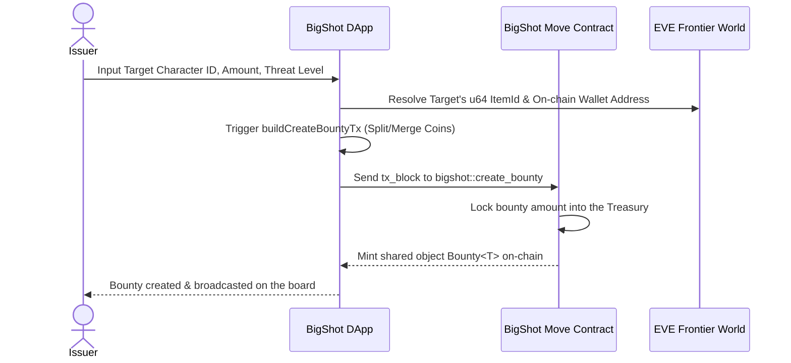
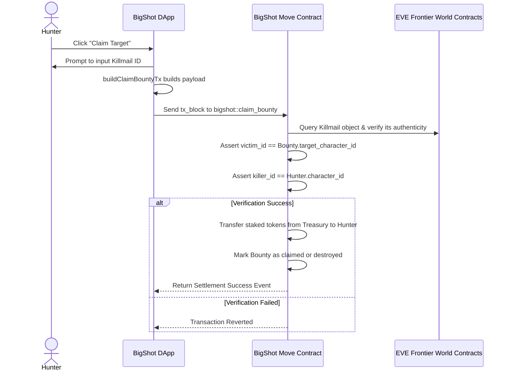
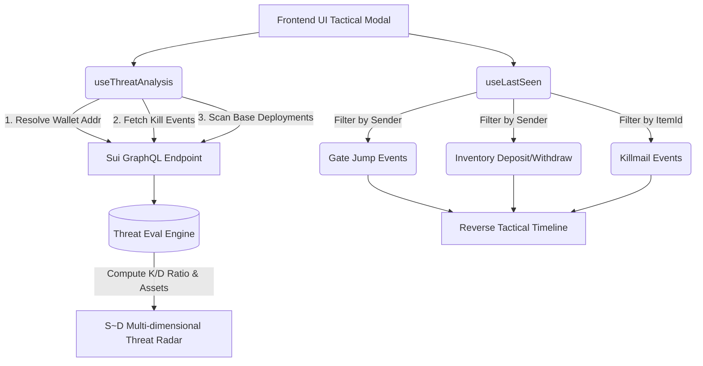

[阅读中文版 (Read in Chinese)](./README-zh.md)

# BigShot - EVE Frontier Decentralised Bounty Protocol

## 1. Project Overview

BigShot is a decentralized bounty system DApp built specifically for **EVE Frontier**. Leveraging the high performance and asset-oriented smart contracts (Move) of the **Sui Blockchain**, it allows players to issue bounties on specific in-game characters with staked assets. Bounty hunters can then trustlessly claim these bounties by providing an on-chain generated "Killmail" object.

### Core Features
- **On-Chain Escrow**: Employers stake Native `SUI`, `EVE`, or in-game `LUX` tokens to issue bounties. Funds are securely locked in the smart contract's Treasury, eliminating middlemen.
- **Native Killmail Check**: Hunters directly query the smart contract to verify native `Killmail` objects from the EVE Frontier World, completely preventing forged screenshots.
- **Anonymous Hunting and Claims**: Integrated with zkLogin, hunters can safely extract crypto assets without exposing their on-chain identity.
- **Tactical Intelligence**: Utilizes Sui GraphQL to query the target character's recent Jumps, Killmails, and Inventory interactions (Deposit/Withdraw), providing hunters with visualized timelines and multi-dimensional "Threat Level" analyses.

---

## 2. Architecture & Core Operation Flow

The complete protocol involves three main roles: **Issuer**, **Hunter**, and the **Target**. The major flows include bounty creation, viewing/taking bounties, and settlement.

### 2.1 Bounty Creation Flow

Uses specified tokens as reserve assets (like SUI, EVE, or LUX) and creates a shared `Bounty` object on-chain.

### 2.2 Claiming Bounty Flow

After a successful kill, the game's world engine generates a `Killmail` object. The transaction is verified and settled decentrally by comparing the information on this object.

### 2.3 On-Chain Intelligence & Tactical Radar (Tactical Analysis)

A unique highlight of this project is that it goes beyond simple listings. It utilizes Sui GraphQL to scrape massive amounts of on-chain events and parse a tactical report against specific players:

---

## 3. Core Directory & Code Module Breakdown (`dapps/src/`)

- **`transactions/`**: Transaction Assembly Layer.
  - `buildCreateBountyTx.ts`: Manages `MergeCoins`, `SplitCoins`, and generates the `create_bounty` contract caller payload.
  - `buildClaimBountyTx.ts`: Generates the transaction block for `claim_bounty`, supplying the `Killmail` proof object and the hunter's own character ID.

- **`hooks/`**: Business Logic and State Management.
  - `useBounties.ts` / `useBountyDetail.ts`: Uses `@mysten/dapp-kit` to fetch `Bounty<T>` objects on-chain, automatically reading and filtering out claimed/expired contracts.
  - `useThreatAnalysis.ts`: Analyzes smart modules (like `StorageUnit`, `Gate`, `Turret`) alongside EVE token balances to compute a dynamic strength rating (converted to an S/A/B/C/D class scoring system).
  - `useLastSeen.ts`: Queries GraphQL to consolidate events scattered across various packages, providing a tracking panel presentation.

- **`utils/`**: Utilities & Helpers.
  - `suiClient.ts`: Responsible for issuing complex Sui GraphQL queries. It cleverly uses GraphQL aliases to union-query `events(...)` minimizing timeouts, while utilizing the new `address(address: $objOwner)` interface to extract assets.
  - `characterNameCache.ts`: Fetches all character dictionaries on the EVE Frontier world to build an in-memory cache map (`u64 item_id` -> `Player Alias`), allowing the application layer to reverse-lookup player names purely by ID.

- **`components/` & `pages/`**: Presentation Layer.
  - Adopts a Sci-fi/Industrial dark theme UI (see `index.css`). Renders data-intensive charts via components like `TacticalTimelineModal.tsx`. Furthermore, it operates without an external frontend router package, relying purely on `window.location.hash` for ultra-lightweight page routing (`App.tsx`).
